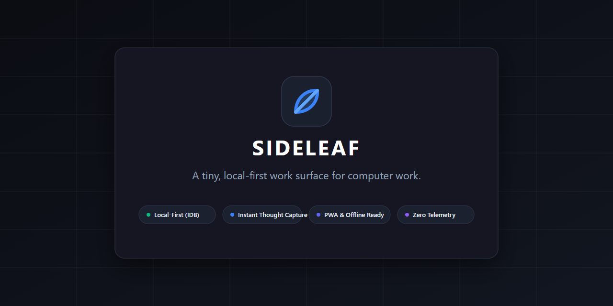

# Sideleaf

> A tiny, local-first work surface for computer work.

<p align="center">
  
</p>

<p align="center">
  <a href="LICENSE"></a>
  <a href="https://github.com/ferhatwork/sideleaf/actions/workflows/build.yml"></a>
  <a href="#development"></a>
  <a href="https://www.typescriptlang.org/"></a>
</p>

Sideleaf is a lightweight, local-first work surface for capturing thoughts, notes, links, and small tasks while working at a computer.

It is deliberately designed without the clutter and friction of complex tools, functioning like a quiet scratchpad sitting right beside your keyboard.

---

## Why Sideleaf?

- **Digital Paper, Not a Dashboard**: Designed like a sheet of paper beside your keyboard. No card-heavy clutter, no KPI counters, and no forced categories.
- **Capture First, Structure Later**: Keep notes as raw scratchpad lines, or transform them into checklist tasks (`Ctrl+Enter`), architectural decisions, or quotes when context demands it.
- **Fast Thought Capture**: Press `Ctrl+Space` (or `Cmd+Space`) anywhere to capture thoughts in under 1 second without choosing folders or note types.
- **Keyboard-First Ergonomics**: Every primary interaction—from capturing thoughts to searching memory and marking tasks—is accessible entirely via keyboard shortcuts.
- **Local-First & Private**: Notes and workspaces stay locally on your device in your browser's IndexedDB. Zero accounts required, zero server dependencies, and zero trackers.
- **Sub-Millisecond Memory**: Press `Ctrl+K` for an instant keyboard-driven search palette with multi-factor relevance ranking showing context snippets ("What was I doing?").
- **Lightweight Bundle**: Static production bundle is under 105 kB gzipped with sub-second startup.
- **PWA & Offline Ready**: Works completely with network connections turned off or on airplane mode.

---

## Core Features

- **Quick Capture Overlay (`Ctrl+Space`)**: Capture thoughts instantly without switching away from your current context.
- **Scratch Surface**: An unorganized capture stream for thoughts that don't need a dedicated home yet.
- **Contextual Workspaces**: Group notes by project or initiative only when the work demands it.
- **Sub-Millisecond Search (`Ctrl+K`)**: Real-time multi-factor search across titles, content, tags, and source links.
- **Data Portability**: One-click exports to versioned `.sideleaf` JSON backup files or standard Markdown (`.md`). Seamless backwards compatibility for legacy `.workpad` files.
- **Localization**: Full built-in English and Turkish support with instant runtime language switching.

---

## How to Use

### Use Sideleaf

1. **Open Sideleaf** (double-click `Sideleaf.bat` on Windows, run `./Sideleaf.sh` on macOS/Linux, or install as a PWA).
2. **Start writing** — no account, no setup, and no folder selection required.
3. **Press `Ctrl + Space`** (or `Cmd + Space`) for Quick Capture from anywhere.
4. **Your data is stored locally** in your browser's IndexedDB.

### End-User Launchers

Sideleaf is designed so that non-technical users do not need Node.js, npm, a terminal, or a dev server.

#### Windows (One-Click)
- Double-click **`Sideleaf.bat`** in the Sideleaf folder.
- Starts a minimal, secure local process bound strictly to loopback `http://127.0.0.1:[port]/` using built-in Windows PowerShell and opens your default browser.
- *(Optional)* Double-click `scripts/create-desktop-shortcut.bat` to create a dedicated Desktop shortcut with the Sideleaf icon.

#### macOS & Linux
- Open a terminal in the Sideleaf folder and run:
  ```bash
  ./Sideleaf.sh
  ```
- Automatically detects Python 3 or Node.js on your system, binds strictly to `127.0.0.1`, and opens your default browser.

#### Progressive Web App (PWA)
- **Chrome / Edge**: Click the install icon in the address bar or choose **"Install Sideleaf"** in the top navigation or Settings.
- **Safari (macOS Sonoma+)**: Click **File → Add to Dock**.
- Once installed, Sideleaf opens in its own standalone, clean window without browser toolbars.

### Keyboard Shortcuts

| Shortcut | Action |
| --- | --- |
| `Ctrl + Space` / `Cmd + Space` | **Quick Capture** floating overlay |
| `Ctrl + Shift + Space` / `Cmd + Shift + Space` | Quick Capture (alternate fallback) |
| `Ctrl + K` / `Cmd + K` | **Search** / Command Palette |
| `Ctrl + Enter` / `Cmd + Enter` | Convert item to Checklist / Toggle Task |
| `Ctrl + Z` / `Cmd + Z` | **Undo** last action (delete, edit, archive) |
| `Ctrl + Shift + Z` / `Cmd + Shift + Z` | **Redo** undone action |
| `Ctrl + S` / `Cmd + S` | Download complete `.sideleaf` backup |
| `Esc` | Close any active modal or cancel |
| `?` | View keyboard shortcut reference |
| `Enter` | Save capture in quick input / overlay |
| `Shift + Enter` | Insert newline in capture textarea |

---

## Data & Privacy

### Local Storage Guarantee
- **Local-Only Storage**: 100% of notes, workspaces, and settings remain in your browser's local IndexedDB database (`sideleaf_db`, with `sideleaf_ls_*` fallback in localStorage).
- **No Third-Party Scripts**: No tracking pixels, Google Analytics, telemetry, remote CDN fonts, or external scripts.
- **In-Memory Search**: Search indexing and multi-factor ranking execute directly in browser memory without sending queries over any network.

### Backups & Data Portability
- **Portable `.sideleaf` Backups**: Export your entire work state into versioned JSON files (`sideleaf-v1` schema, with backwards compatibility for `.workpad` files).
- **Markdown Export**: Export any workspace into standard GitHub Flavored Markdown (`.md`) format preserving task checkboxes (`- [ ]` / `- [x]`), quotes, and source links.
- **Import Strategies**: When importing a backup file, choose between **Merge** (safely keeps existing data), **New Workspace** (isolates imported notes), or **Replace** (full restore).

### Uninstallation & Data Removal
- **PWA**: Right-click the app icon and select **Uninstall Sideleaf**.
- **Local Launcher**: Delete the Sideleaf folder.
- **Wiping Local Data**: To erase browser-stored notes completely, click **"Clear All Data"** in Sideleaf Settings, or clear website storage for `localhost` in your browser settings.

---

## Development

Developers can clone the repository and use standard npm commands:

```bash
# 1. Install dependencies
npm install

# 2. Start local development server with Vite HMR
npm run dev

# 3. Run test suite with Vitest
npm test

# 4. Build production static bundle (dist/)
npm run build

# 5. Run zero-dependency local production launcher
npm run launch

# 6. Package standalone portable distribution bundle
npm run package
```

### Distribution Modes

| Mode | Target | Description |
| --- | --- | --- |
| **Static Web Hosting** | Public Web / Internal Teams | Run `npm run build` to output `dist/`. Deploy to GitHub Pages, Cloudflare Pages, Netlify, Vercel, or any static HTTP host. No backend required. |
| **PWA (Progressive Web App)** | Desktop / Mobile Users | Standalone application window, offline service worker caching, application icons (`192x192`, `512x512`, SVG, ICO). |
| **Local Launcher Package** | Local-First Desktops | Portable folder with `Sideleaf.bat` (Windows PowerShell `HttpListener`), `Sideleaf.sh` (macOS/Linux), and `scripts/launcher.mjs`. Binds strictly to `127.0.0.1`. |

---

## License

Sideleaf is source-available under the **PolyForm Noncommercial License 1.0.0**.

### Plain-English Summary

This is an informal, plain-English summary of the key permissions and restrictions under the license. The legally binding and authoritative terms are set out in the [LICENSE](LICENSE) file:

- **Personal & Noncommercial Use Permitted**: You may freely use Sideleaf for personal study, private experimentation, hobby projects, research for public knowledge, amateur pursuits, or within eligible noncommercial organizations (such as schools, charities, and public institutions).
- **Source Code Inspection**: You are welcome to review, inspect, and read the source code.
- **Noncommercial Modifications**: You may modify the source code and create derivative works for noncommercial purposes.
- **Commercial Use Prohibited**: Commercial use, business operations intended for commercial advantage, or generating commercial revenue is strictly prohibited under this license.
- **Selling Prohibited**: You may not sell Sideleaf or charge fees for copies of the software.
- **Commercial Derivative Sales Prohibited**: You may not sell or monetize modified versions or works based on Sideleaf.
- **Commercial Integration Requires Separate Permission**: Incorporating Sideleaf into a commercial product, SaaS platform, or paid service requires explicit permission or a separate commercial agreement from the copyright holder.

> [!NOTE]
> This summary is provided for convenience and understanding only. It does not replace, expand, or limit the actual legal terms. For the authoritative legal terms and conditions, please consult the [LICENSE](LICENSE) file.

---

## Contributing & Security

- **Contributing**: Please review [CONTRIBUTING.md](CONTRIBUTING.md) for development guidelines, testing standards, and pull request expectations.
- **Security & Privacy**: Review [SECURITY.md](SECURITY.md) for responsible disclosure procedures and vulnerability reporting.
- **Issues**: Use the [Bug Report](.github/ISSUE_TEMPLATE/bug_report.md) or [Feature Request](.github/ISSUE_TEMPLATE/feature_request.md) templates to report issues or suggest ideas.
